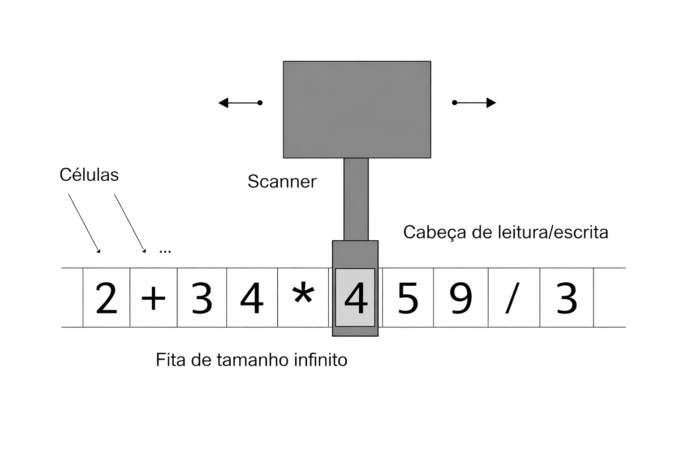

<h1 align="center">Máquina de Turing</h1>

<p align="center">
  
</p>

## 📌 Propósito

Projeto proposto pela instituição **Programadores do Amanhã**, desenvolvido na turma do **Code Lab**, com o objetivo de simular o funcionamento de uma **Máquina de Turing**, explorando seus conceitos fundamentais por meio de uma implementação prática.

## 🧠 O que é a Máquina de Turing?

A Máquina de Turing é um modelo teórico de computação criado por **Alan Turing**, utilizado para descrever como algoritmos podem ser executados passo a passo. Apesar de ser um conceito abstrato, ela é poderosa o suficiente para representar qualquer computação que um computador moderno seja capaz de realizar.

Seu funcionamento é baseado em três componentes principais:

- **Uma fita infinita**, que funciona como memória  
- **Um cabeçote de leitura e escrita**, que percorre a fita  
- **Um conjunto de estados e regras**, que determinam as ações da máquina  

Neste projeto, a Máquina de Turing é simulada utilizando um **array**, que representa a fita. A partir disso, são realizadas operações aritméticas básicas, como:

- Soma  
- Subtração  
- Multiplicação  
- Divisão  
- Módulo  

O objetivo é demonstrar, de forma prática, como esse modelo computacional funciona.

## ⚙️ Funcionamento



Arquivo ```src/input ```:

    Este arquivo é onde fica o array com o nome input que é destinado para armazenar as operações que deseja realizar

Exemplo do array: 

```JavaScript
const input = [2, "+", 3, 4, "*", 5, 9, "/", 3];
```

Arquivo ```src/turingMachine ```

    Esta função é o "cérebro" da nossa máquina. Ela percorre o array de entrada e processa as informações seguindo esta lógica:

    Leitura em blocos: A função percorre a fita (input) de 3 em 3 elementos. Cada bloco representa uma operação completa no formato: [operando1, operador, operando2].

    Processamento: Para cada bloco, ela identifica o operador (como +, -, *, /, %) e utiliza o módulo Operations para calcular o resultado.

    Validação: O algoritmo verifica se a operação é permitida e evita erros fatais, como a divisão por zero.

    Saída: Os resultados de cada bloco são armazenados em um novo array (output), que é retornado ao final da execução, simulando o estado final da fita de saída.
Para rodar o codigo digite no terminal:

```bash
    node main.js
```

O resultado será imprimido no terminal com o array resultante

Exemplo de impressão:

```bash
    [5, 20, 3]
```

Exemplos de erros: 

Caso apresente um operando que não seja um dos permitidos:

```bash
    Há ao menos uma operação não permitida, informe somente operações válidas
```

Caso o tipo de um dos operandos não seja do tipo number

```bash
    Operando não permitido, os operandos tem que ser do tipo number
```
